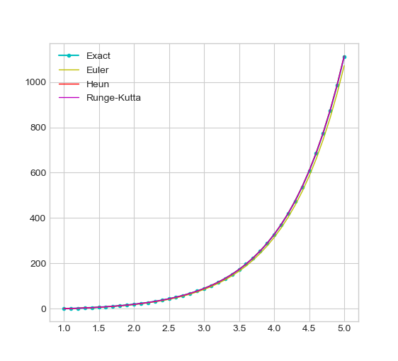
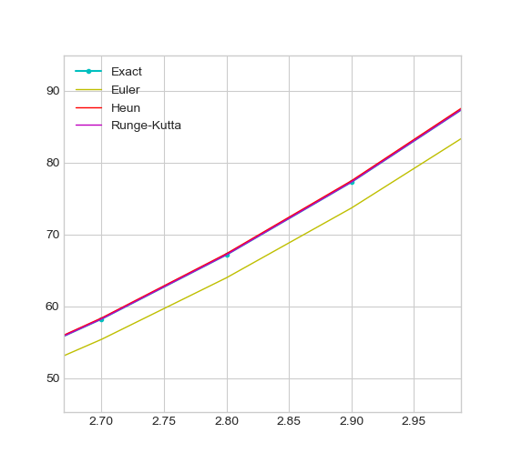
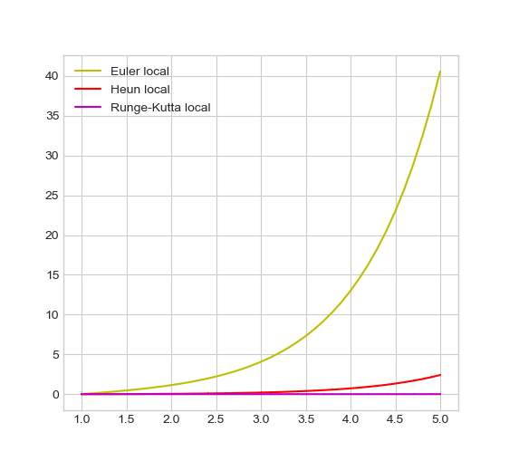
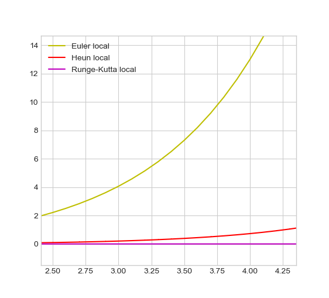
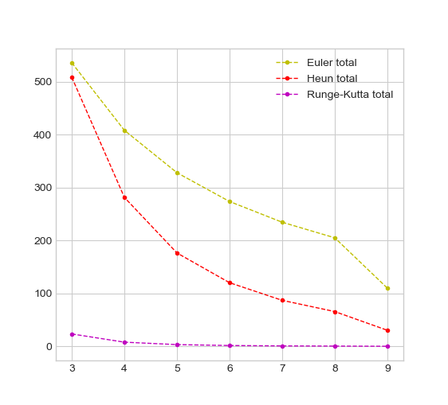

# numerical_meth_ode
### Introduction 
This is a Tkinter application which plots approximations of a differential equation solution using the following methods:

* Euler
* Heun (Improved Euler)
* Runge-Kutta

Here is the initial value problem (IVP)

$$\begin{cases}
	y' &=& 3xe^{x} - y\ (1-\frac{1}{x})  \\ 
	y\ (1) &=& 0
\end{cases}$$

This document shows to get the exact solution of the IVP and then demostrates all the methods listed above. 

### 1. Exact solution
Linear, nonhomogeneous ode of the first degree
$$y' = 3xe^{x} - y\ (1-\frac{1}{x})$$
Lets find the general solution first.

Solve the complementary equation
$$y' + y\ (1 - \frac{1}{x}) = 0$$
Turn it into separable form and apply integration
$$\begin{align} &\int{\frac{dy}{y}} = \int{(\frac{1}{x}-1)dx} \\  \\&\ln{|y|}  = \ln{|x|} - x + C  \\ \\ &y = xke^{-x}\end{align}$$
Assume that k equals = 1. To find the general solution, apply substitution
$$\begin{cases}
	y &=& uy_1 \\
	y' &=& u'y_1 + uy_1
\end{cases}$$
where y~1~ is the solution of the complementary.

Substituting y' and y into the intial equation, we get
$$\begin{align} &u' = \frac{3xe^{x}}{y_1}  \\ \\ &u = \int{\frac{3xe^x dx}{xe^{-x}}}\end{align}$$

Substituting y back and integrating gives
$$\begin{align} &y = xe^{-x} \int{\frac{3xe^{x} dx}{xe^{-x}}} \\ \\
&y = x\frac{3xe^{x}}{2} + Ce^{-x}\end{align}$$

Using the initial conditions given, we derive the constant C
$$C = \frac{-3e^{2}}{2}$$
Thus, we have a solution
$$y = \frac{3xe^{-x}}{2}(e^{2x} - e^2)$$

### 2. Methods overview

All approximations below are computed with the following parameters:

* x0 = 1
* y0 = 0
* X = 5
* h = 0.1
* n0 = 3
* N = 9

#### Comparison with the exact solution

 

#### Local errors

#### Total errors

### 3. Application overview

Mikhail Lyamets BS17-07
